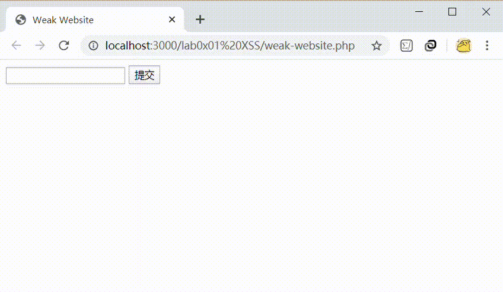

# 搭建漏洞网站及 XSS 攻击

## 实验要求

- [x] 编写漏洞网页，使之可以进行 XSS 攻击

## 实验过程

### VSCode 搭建 PHP 开发环境

#### 安装 PHP

- 从 http://windows.php.net/download/ 下载 PHP

- 将下载的压缩包移动到`C:\php`并解压
- 在`C:\php`文件夹下新建文件`php.ini`，内容与`php.ini-production`的相同（[Php.ini production vs development](https://stackoverflow.com/a/35211463/13542937)）
- 编辑`php.ini`，取消`extension_dir = "ext"`的注释，并取消一些基础扩展的注释
    ```
    extension=bz2
    extension=curl
    extension=fileinfo
    extension=gd2
    extension=intl
    extension=mbstring
    extension=exif
    extension=openssl
    ```
- 将`C:\php`添加至环境变量

#### VSCode 配置

- 修改用户设置`settings.json`，添加
    ```js
    "php.executablePath": "C:\\php\\php.exe",
    "php.validate.executablePath": "C:\\php\\php.exe",
    "php.validate.enable": true,
    "php.validate.run": "onType",
    "phpserver.phpPath": "C:\\php\\php.exe",
    ```
- 安装插件 PHP Server（`Serve Project`运行 PHP 脚本）

### 基本网页

- 代码
    ```php
    <!DOCTYPE html>
    <html>
    <head>
        <meta charset="UTF-8">
        <title>Weak Website</title>
    </head>
    <body>
        <form method="post">
            <input type="text" name="xss">
            <input type="submit" value="提交">
        </form>
        <?php
            if(isset($_POST["xss"]))
            {
                echo $_POST["xss"];
            }
        ?>
    </body>
    </html>
    ```
- 效果展示<br>


## 参考资料

- [Developing PHP in Visual Studio Code for Dummies](https://github.com/Kentico/kontent-delivery-sdk-php/wiki/Developing-PHP-in-Visual-Studio-Code-for-Dummies)
- [Microsoft VS Code: When I try to launch my program error “spawn php ENOENT” shows up](https://stackoverflow.com/questions/49240957/microsoft-vs-code-when-i-try-to-launch-my-program-error-spawn-php-enoent-show)