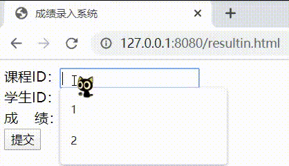
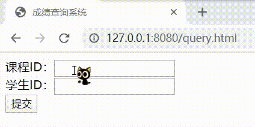

# 原始 Web 开发体验

## 实验要求

在`httpserver.py`的基础上：
- [x] 编写教师录入成绩页面
  - 课程id、学生id、成绩
- [x] 编写学生查询成绩页面
  - 输入学生id或课程id查询

## 实验过程

### 创建数据库及表

```bash
# 当前环境：httpserver.py 所在文件夹
# 创建数据库 edu.sb 并进入交互式终端
sqlite3 edu.db

# 创建 results 表
CREATE TABLE results(
  cid    INTEGER,
  sid    INTEGER,
  res    INTEGER
);
```

### 编写页面

- 创建`resultin.html`作为教师录入成绩页面
  ```html
  <!DOCTYPE html>
  <html lang='zh-CN'>
      <head>
          <meta charset="utf-8">
          <title>成绩录入系统</title>
      </head>
      <body>
          <form method='post' enctype='multipart/form-data'>
          课程ID：<input type='text' name='cid'><br>
          学生ID：<input type='text' name='sid'><br>
          成 &nbsp;&nbsp; 绩：<input type='text' name='res'><br>
          <input type='submit'>
          </form>
      </body>
  </html>
  ```
- 创建`query.html`作为学生查询成绩页面
  ```html
  <!DOCTYPE html>
  <html lang='zh-CN'>
      <head>
          <meta charset="utf-8">
          <title>成绩查询系统</title>
      </head>
      <body>
          <form method='post' enctype='multipart/form-data'>
          课程ID：<input type='text' name='cid'><br>
          学生ID：<input type='text' name='sid'><br>
          <input type='submit'>
          </form>
      </body>
  </html>
  ```

### 处理 POST 请求

修改`do_POST`函数
```py
def do_POST(self):
    ans = "OK"
    '''
    # 未改动部分
    form_data = cgi.FieldStorage(
        fp=self.rfile,
        headers=self.headers,
        environ={
            'REQUEST_METHOD': 'POST',
            'CONTENT_TYPE': self.headers['Content-Type'],
        })
    fields = form_data.keys()
    if self.field_name in fields:
        input_data = form_data[self.field_name].value
        file = open("."+self.path, "wb")
        file.write(input_data.encode())
    '''
    # 通过表单项来分辨当前页面
    elif 'res' in fields: # 当前为录入成绩
        cid, sid = form_data['cid'].value, form_data['sid'].value
        res = form_data['res'].value
        conn = sqlite3.connect('edu.db')
        c = conn.cursor()
        sql = "insert into results values (%s, %s, %s)"%(cid, sid, res)
        c.execute(sql)
        conn.commit()
        conn.close()
    else:   # 当前为成绩查询
        cid, sid = form_data['cid'].value, form_data['sid'].value
        conn = sqlite3.connect('edu.db')
        c = conn.cursor()
        sql = "select res from results where cid=%s and sid=%s"%(cid, sid)
        c.execute(sql)
        ans = "%s 同学 %s 课程的成绩为 " % (sid, cid) + str(c.fetchone()[0])
        conn.close()
    '''
    # 未改动部分
    self.send_response(200)
    self.send_header("Content-type", "text/html")
    self.end_headers()
    '''
    self.wfile.write(bytes(str("<html lang='zh-CN'><head><meta charset='utf-8'></head><body>%s</body></html>"%(ans)), 'utf-8'))
```

## 效果展示

### 教师录入成绩页面



### 学生查询成绩页面



## 参考资料

- [sqlite3 — DB-API 2.0 interface for SQLite databases](https://docs.python.org/3/library/sqlite3.html)