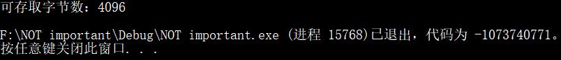
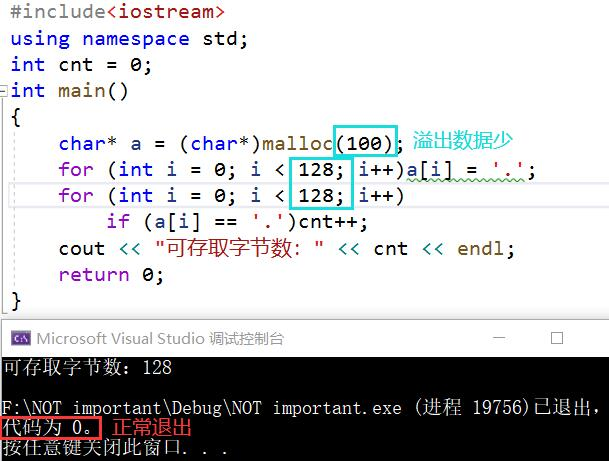
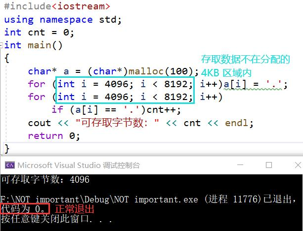
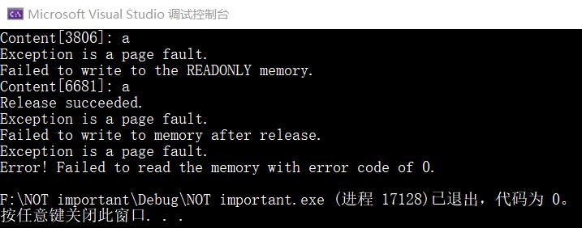
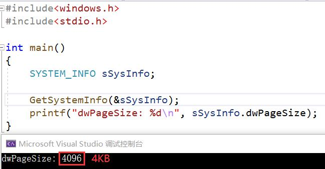

# 内存管理

## 实验要求

- [x] 阅读 VirtualAlloc、VirtualFree、VirtualProtect 等函数的官方文档
- [x] 编程使用`malloc`分配一段内存，测试这段内存所在的整个 4KB 区域是否都可以写入读取
- [x] 使用 VirtualAlloc 分配一段可读可写的内存，写入内存，然后将这段内存改为只读，再读数据和写数据，看是否会有异常情况。接着 VirtualFree 这段内存，再测试对这段内存的读写是否正常。

## 实验过程

### 分配内存并测试

- CHAR 类型数据占 1 个字节，4KB 为 4096 个字节
- 检验代码
    ```cpp
    #include<iostream>
    using namespace std;
    int cnt = 0;
    int main()
    {
        char* a = (char*)malloc(100);
        for (int i = 0; i < 4096; i++)a[i] = '.';
        for (int i = 0; i < 4096; i++)
            if (a[i] == '.')cnt++;
        cout << "可存取字节数：" << cnt << endl;
        return 0;
    }
    ```
- 由于系统以 4KB 为单位管理内存，虽然只分配了 100 个字节，但这 100 个字节所在的 4KB 区域都可以写入、读取数据<br>

- 由于溢出的数据过多覆盖了其他正常的数据导致程序无法正常退出（程序可能运行不出结果，那么覆盖的数据具有一定的随机性，推测分配的 100 字节在 4KB 区域中的位置可能不同）
- 若溢出的字节数较少，则对程序的影响较小<br>

- 如果存取访问分配的 4KB 以外的数据，检测程序可以正常退出，推测系统给检测程序分配的内存为 4KB，覆盖的是检测程序外的未知区域<br>


### VirtualAlloc 和 VirtualFree

- VirtualAlloc 中的分配类型

  值|含义
  -|-
  MEM_RESERVE|保留虚拟地址空间，不分配物理内存。后续还可以调用 VirtualAlloc 来提交保留的页面。其他分配内存的函数，如 malloc 或 LocalAlloc，无法使用保留的内存，直到其被释放
  MEM_COMMIT|为指定已保留的地址空间提交物理内存，初始内容为 0。实际物理页只在虚拟地址被访问后才分配
- 使用 VirtualAlloc 分配一段可读可写的内存，返回值为分配内存页的首地址
    ```c
    lpvBase = VirtualAlloc(
            NULL,	// System selects address
            PAGELIMIT * dwPageSize,	// 分配的大小
            MEM_COMMIT|MEM_RESERVE,	// To reserve and commit pages in one step
            PAGE_READWRITE	// 可读可写
        );
    ```
- 使用 VirtualProtect 修改一段内存的访问属性，修改成功返回值非0，修改失败返回0
    ```c
    bSuccess = VirtualProtect(
            lpvBase,
            PAGELIMIT * dwPageSize,	// 需要改变访问属性的区域大小
            PAGE_READONLY,		// 只读
            &oldProtect	// 在修改前，旧的访问属性将被存储
        );
    ```
- 使用 VirtualFree 释放一段内存
  - 如果 dwFreeType 参数的值为 MEM_RELEASE，dwSize 参数的值必须为0，函数将释放 VirtualAlloc 初始保留的整个区域
    ```c
    bSuccess = VirtualFree(
            lpvBase,       // Base address of block
            0,             // dwSize
            MEM_RELEASE);  // dwFreeType
        printf("Release %s.\n", bSuccess ? "succeeded" : "failed");
    ```
- 实验完整测试代码如下：
    ```c
    #include<windows.h>
    #include<stdio.h>
    #include<stdlib.h>
    #include<time.h>

    #define PAGELIMIT 5 // Number of pages to ask for

    DWORD dwPageSize;       // Page size on this computer
    LPTSTR lpPtr;       // Generic character pointer

    int PageFaultExceptionFilter(DWORD dwCode)
    {
        // If the exception is not a page fault, exit.
        if (dwCode != EXCEPTION_ACCESS_VIOLATION)
        {
            printf("Exception code = %d.\n", dwCode);
            return EXCEPTION_EXECUTE_HANDLER;
        }
        printf("Exception is a page fault.\n");
        return EXCEPTION_EXECUTE_HANDLER;
    }

    void ErrorExit(LPTSTR lpMsg)
    {
        printf("Error! %s with error code of %ld.\n", lpMsg, GetLastError());
        exit(0);
    }

    void ReadTest()
    {
        __try
        {
            // 访问页内随机地址
            int add = rand() % (PAGELIMIT * dwPageSize);
            printf("Content[%d]: %c\n", add, lpPtr[add]);
        }
        __except (PageFaultExceptionFilter(GetExceptionCode()))
        {
            ErrorExit("Failed to read the memory");
        }
    }

    int main()
    {
        srand(time(NULL));

        LPVOID lpvBase;     // Base address of the test memory
        SYSTEM_INFO sSysInfo;	// Useful information about the system
        BOOL bSuccess;      // Flag

        GetSystemInfo(&sSysInfo);     // Initialize the structure.

        dwPageSize = sSysInfo.dwPageSize;

        lpvBase = VirtualAlloc(
            NULL,	// System selects address
            PAGELIMIT * dwPageSize,	// 分配的大小
            MEM_COMMIT|MEM_RESERVE,	// To reserve and commit pages in one step
            PAGE_READWRITE	// 可读可写
        );
        if (lpvBase == NULL)
            ErrorExit("VirtualAlloc reserve failed");

        lpPtr = (LPTSTR)lpvBase;

        for (int i = 0; i < PAGELIMIT * dwPageSize; i++)
        {
            __try
            {
                lpPtr[i] = 'a';	// 写入内存
            }
            __except(PageFaultExceptionFilter(GetExceptionCode()))
            {
                ErrorExit("Failed to write to memory");
            }
        }

        ReadTest();

        DWORD oldProtect;
        bSuccess = VirtualProtect(
            lpvBase,
            PAGELIMIT * dwPageSize,	// 需要改变访问属性的区域大小
            PAGE_READONLY,		// 只读
            &oldProtect	// 在修改前，旧的访问属性将被存储
        );

        if (bSuccess == 0)
            ErrorExit("Change access protection attributes failed");

        for (int i = 0; i < PAGELIMIT * dwPageSize; i++)
        {
            __try
            {
                lpPtr[i] = 'b';	// 写入内存
            }
            __except (PageFaultExceptionFilter(GetExceptionCode()))
            {
                printf("Failed to write to the READONLY memory.\n");
                break;
            }
        }

        ReadTest();

        bSuccess = VirtualFree(
            lpvBase,       // Base address of block
            0,             // Bytes of committed pages
            MEM_RELEASE);  // Decommit the pages
        printf("Release %s.\n", bSuccess ? "succeeded" : "failed");

        for (int i = 0; i < PAGELIMIT * dwPageSize; i++)
        {
            __try
            {
                lpPtr[i] = 'c';	// 写入内存
            }
            __except (PageFaultExceptionFilter(GetExceptionCode()))
            {
                printf("Failed to write to memory after release.\n");
                break;
            }
        }

        ReadTest();
    }
    ```
- 运行结果<br>

- 由此可见
  - 由 VirtualAlloc 分配的 PAGE_READWRITE（可读可写）内存可以正常的写入和读取
  - 将访问属性修改为 PAGE_READONLY 后，该段内存无法写入，但可以正常读取
  - 使用 VirtualFree 之后，该段内存无法进行写入和读取

### 内存地址管理的基本单位

- VirtualAlloc 的 dwSize 参数描述中提到：分配的页面包含从 lpAddress 到 lpAddress + dwSize 范围内的一个或多个字节的所有页面，证明分配是以页为单位
- 由 GetSystemInfo 函数获取到的系统信息中的页大小为 4KB<br>

- 因此，内存地址管理的基本单位为 4KB (<ゝωΦ)

## 参考资料

- [VirtualAlloc function](https://docs.microsoft.com/en-us/windows/win32/api/memoryapi/nf-memoryapi-virtualalloc)
- [VirtualFree function](https://docs.microsoft.com/en-us/windows/win32/api/memoryapi/nf-memoryapi-virtualfree)
- [VirtualProtect function](https://docs.microsoft.com/en-us/windows/win32/api/memoryapi/nf-memoryapi-virtualprotect)
- [Memory Protection Constants](https://docs.microsoft.com/zh-cn/windows/win32/memory/memory-protection-constants)
- [Reserving and Committing Memory](https://docs.microsoft.com/zh-cn/windows/win32/memory/reserving-and-committing-memory)