# 内存地址空间

## 实验要求

- [x] 验证不同进程的相同的地址可以保存不同的数据
  - [x] 在 VS 中，设置固定基地址，编写两个不同的可执行文件。同时运行这两个文件。然后使用调试器附加到两个程序的进程，查看内存，看两个程序是否使用了相同的内存地址
  - [x] 在不同的进程中，尝试使用 VirtualAlloc 分配一块相同地址的内存，写入不同的数据。再读出
- [x] 配置一个 Windbg 双机内核调试环境，查阅 Windbg 的文档，了解
  - [x] Windbg 如何在内核调试情况下看物理内存，也就是通过物理地址访问内存
  - [x] 如何查看进程的虚拟内存分页表，在分页表中找到物理内存和虚拟内存的对应关系。然后通过 Windbg 的物理内存查看方式和虚拟内存的查看方式，看同一块物理内存中的数据情况

## 实验过程

### 固定基地址查看运行时内存

- 两个项目： ProjectA 和 ProjectB 都设置了相同的程序基址
  - ProjectA 源代码及设置如下：<br>

    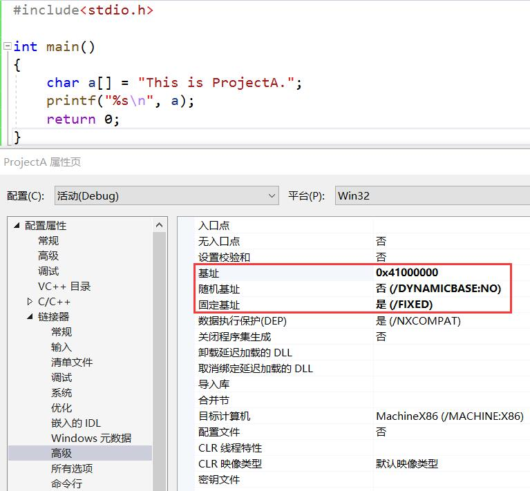
  - ProjectB 源代码及设置如下：<br>

    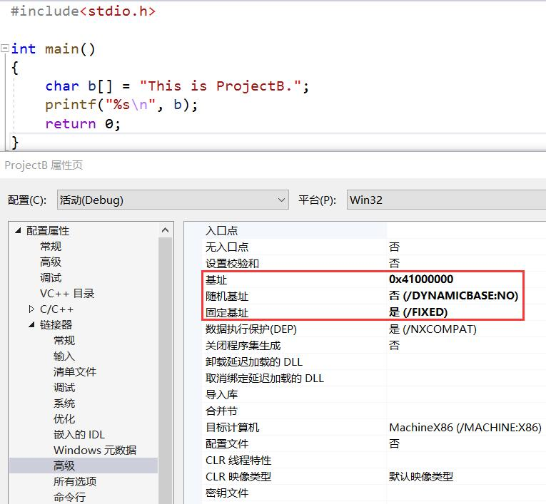
- 同时运行 ProjectA 和 ProjectB 的程序，并查看内存，发现 ProjectA 的进程和 ProjectB 的进程在相同内存地址下存储了不同的信息<br>
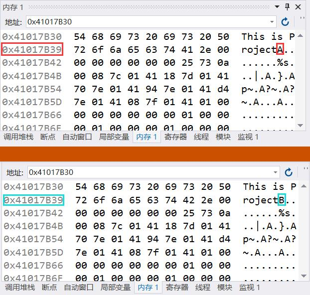

### VirtualAlloc 分配相同地址的内存

- 编写使用 VirtualAlloc 分配指定起始内存地址的内存代码如下（项目设置不一定要固定基址）：
    ```c
    #include<stdio.h>
    #include<windows.h>

    int main()
    {
        LPVOID lpvBase;	// Base address of the test memory
        LPTSTR lpPtr;
        SYSTEM_INFO sSysInfo;	// Useful information about the system

        GetSystemInfo(&sSysInfo);
        DWORD dwPageSize = sSysInfo.dwPageSize;

        lpvBase = VirtualAlloc(
            (LPVOID)0x70000000,	// The starting address of the region to allocate
            dwPageSize,
            MEM_COMMIT | MEM_RESERVE,
            PAGE_READWRITE);

        lpPtr = (LPTSTR)lpvBase;
        for (DWORD i = 0; i < dwPageSize; i++)
        {
            lpPtr[i] = 'a'; // ProjectA 使用字符a，ProjectB 使用字符b
            printf("%c", lpPtr[i]);
        }
        VirtualFree(lpvBase, 0, MEM_RELEASE);
        return 0;
    }
    ```
- 需要注意的是：如果项目使用的是 Unicode 字符集，并且`lpPtr`值的类型为`LPTSTR`（变量类型定义为`LPTSTR`，且`lpvBase`赋值前强制类型转换成`LPTSTR`），那么这时写入的字符会占用两个字节。此时，`for`循环的范围不能是`[0, dwPageSize)`，而是`[0, dwPageSize / 2)`
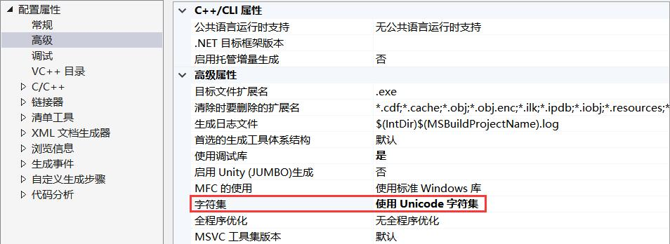
- 将断点下在写入语句，即`lpPtr[i] = 'a'`（或`lpPtr[i] = 'b'`），进入调试模式，查看先写入`a`与先写入`b`是否会对从内存读出的数据产生影响<br>

- 由图可见，相同内存地址存入了不同的数据，证明了不同进程相同内存地址可以保存不同的数据

### 配置 Windbg 双机内核调试环境

#### 配置前提

- Guest 端为 Win7 虚拟机
- Host 端已安装 Windbg

#### Guest 端配置

- 为虚拟机配置虚拟串口，为建立 HOST 到 GUEST 的调试通信连接（注意不要勾选 连接至现有通道或套接字，否则无法启动虚拟机）<br>
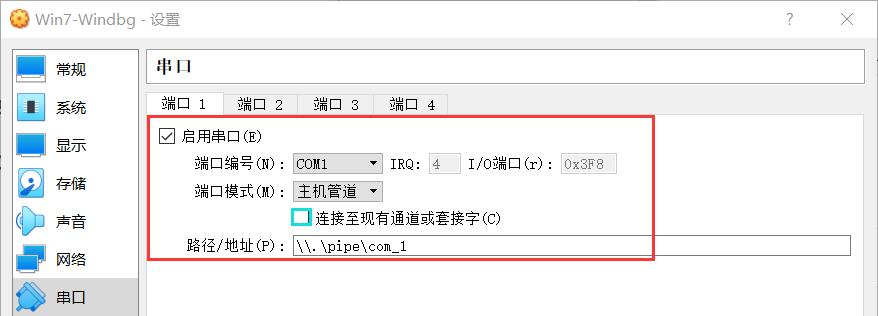
- 启动虚拟机（选择 DebugEntry 操作系统），进入系统内配置。以管理员身份运行`cmd.exe`，输入以下命令：
  ```bash
  bcdedit /dbgsettings serial baudrate:115200 debugport:1
  bcdedit /copy {current} /d DebugEntry
  bcdedit /displayorder {current} {第二个命令显示的UUID}
  bcdedit /debug {第二个命令显示的UUID} on
  ```

#### Host 端配置

- 配置 Windbg 的符号下载地址：`srv*E:\WinSym*https://msdl.microsoft.com/download/symbols`（如果本地没有找到，Windbg 自动在 Microsoft 的 Symbol Servers 上下载）
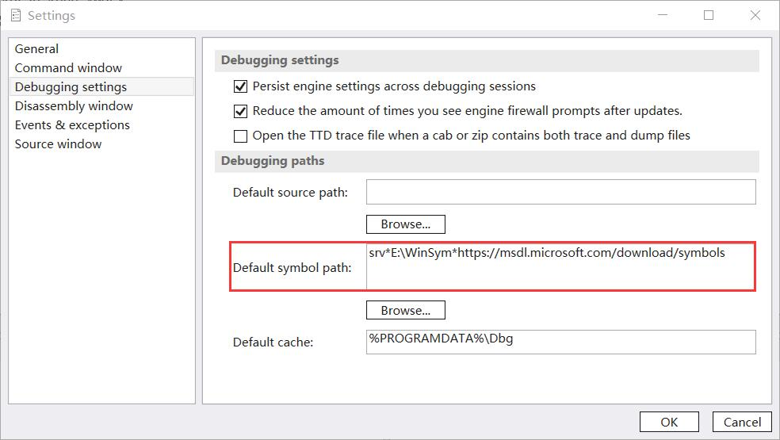
- 在 Guest 端保持在线的情况下，Host 端通过`windbg.exe -k com:port=\\.\pipe\com_1,baud=115200,pipe`命令启动 Windbg（Windbg Preview 使用`windbgX.exe -k com:port=\\.\pipe\com_1,baud=115200,pipe`）
- 连接成功（记得点 Break）<br>
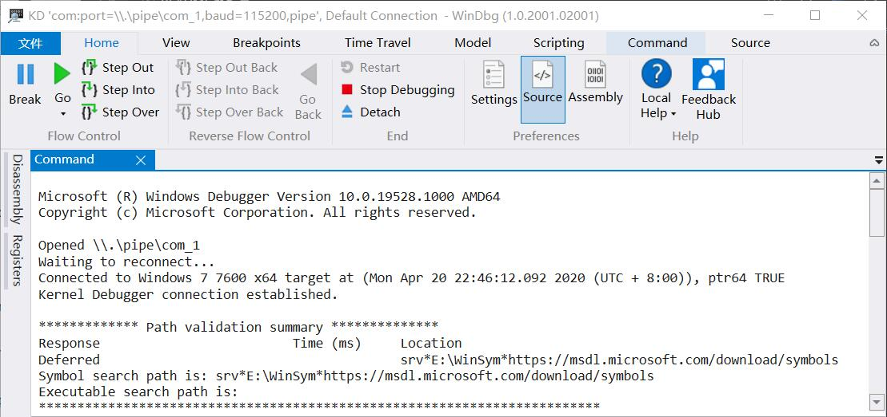

### 通过物理地址访问内存

- 通过物理地址读内存信息，可以使用`!d(b/c/d/p/u/w)`命令（`(b/c/d/p/u/w)`在展示格式和默认长度上有所不同）
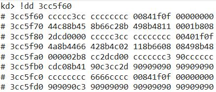
  - `d*`命令查看虚拟内存，除非在内核模式下使用`/p`参数
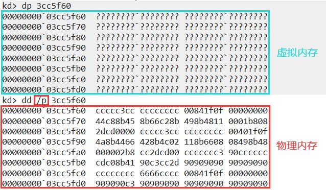
- 通过物理地址写，可以使用`!e(b/d)`命令
- 或者，直接在 Memory 窗口操作
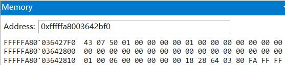

### 从虚拟地址到物理地址

- 假设想转换的虚拟地址是`0xfffff78000001000`
- 一页的大小为 4KB（2<sup>12</sup>），因此页内偏移为`0x000`
- x64 虚拟地址共 64 位，高 16 位为符号扩展，要么全 0，要么全 1。Windows 中，全 1 表示内核地址，全 0 表示用户态地址
- 低 48 位划分如下

  47-39(9 位)|38-30(9 位)|29-21(9 位)|20-12(9 位)|11-0(12 位)
  -|-|-|-|-
  PML4E 索引(PXE) |	PDPTE 索引(PPE) |	PDE(页目录条目) 索引 |	PTE(页表条目) 索引 |	页内偏移
- `!pte`会给出指定地址的查表结果
  ```
  kd> !pte fffff78000001000
                                            VA fffff78000001000
  PXE at FFFFF6FB7DBEDF78    PPE at FFFFF6FB7DBEF000    PDE at FFFFF6FB7DE00000    PTE at FFFFF6FBC0000008
  contains 000000000019D063  contains 00000000001F0063  contains 00000000001EF063  contains 000000002B580963
  pfn 19d       ---DA--KWEV  pfn 1f0       ---DA--KWEV  pfn 1ef       ---DA--KWEV  pfn 2b580     -G-DA--KWEV
  ```
  - 结果的第一行重申了查询的虚拟地址，第二行给出了包含虚拟-物理映射信息各索引的虚拟地址
  - 第二行给出了各索引虚拟地址所包含的具体内容，第三行即是页框号
- 下图为（x64）虚拟地址转换到物理地址的查表过程示例，所以最后实际会用到的只有 PTE 中的页框号和页内偏移地址<br>
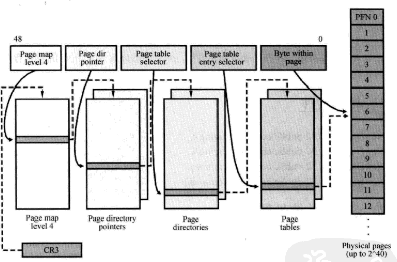
- 找到 PTE 对应的 pfn（页框号），再根据页内偏移计算出实际的物理地址为`0x2b580000`
- 分别使用物理地址和虚拟地址访问内存，发现内容一致<br>
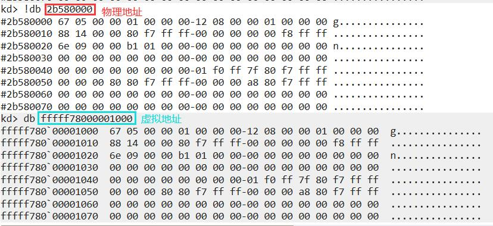

## 参考资料

- [VirtualAlloc function](https://docs.microsoft.com/en-us/windows/win32/api/memoryapi/nf-memoryapi-virtualalloc)
- [VirtualAlloc question - MSDN - Microsoft](https://social.msdn.microsoft.com/Forums/en-US/a61e1f3c-680c-4ed3-acb3-08de5fb9a92f/virtualalloc-question?forum=vcgeneral)
- [Windows 内核调试 - 知乎](https://zhuanlan.zhihu.com/p/47771088)
- [Accessing Memory by Physical Address](https://docs.microsoft.com/en-us/windows-hardware/drivers/debugger/accessing-memory-by-physical-address)
- [!db, !dc, !dd, !dp, !dq, !du, !dw](https://docs.microsoft.com/en-us/windows-hardware/drivers/debugger/-db---dc---dd---dp---dq---du---dw)
- [d, da, db, dc, dd, dD, df, dp, dq, du, dw (Display Memory)](https://docs.microsoft.com/en-us/windows-hardware/drivers/debugger/d--da--db--dc--dd--dd--df--dp--dq--du--dw--dw--dyb--dyd--display-memor)
- [Converting Virtual Addresses to Physical Addresses](https://docs.microsoft.com/en-us/windows-hardware/drivers/debugger/converting-virtual-addresses-to-physical-addresses)
- [!pte](https://docs.microsoft.com/en-us/windows-hardware/drivers/debugger/-pte)
- [X64下的虚拟地址到物理地址的转换](https://bbs.pediy.com/thread-203391.htm)
- [windbg由虚拟地址查找对应物理地址（内核调试）](https://blog.csdn.net/wesley2005/article/details/81303435)