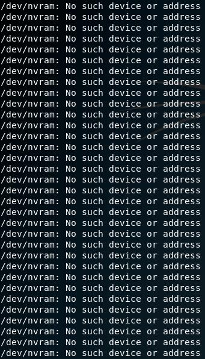
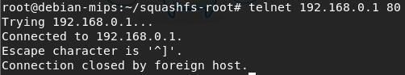
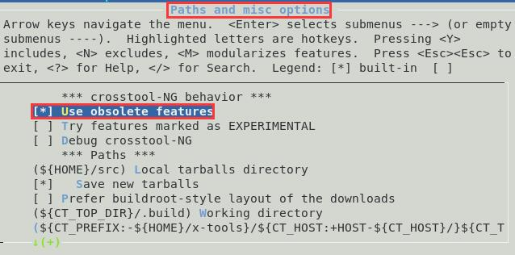
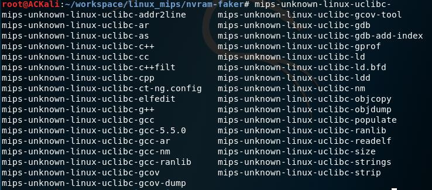

# Fuzzing

## 实验要求

- [x] 搜集市面上主要的路由器厂家、在厂家官网中寻找可下载的固件，在 CVE 漏洞数据中查找主要家用路由器厂家已经公开的漏洞，选择一两个能下载到且有已经公开漏洞的固件
- [ ] 下载对应版本的固件后，在 QEMU 中模拟运行。确定攻击面（对哪个端口哪个协议进行 Fuzzing 测试），尽可能多的抓取攻击面正常的数据包（Wireshark）
- [ ] 查阅 BooFuzz 的文档，编写对这个攻击面，这个协议的脚本，进行 Fuzzing。配置 BooFuzz QEMU 的崩溃异常检测，争取触发一次固件崩溃，获得崩溃相关的输入测试样本和日志
- [ ] 尝试使用调试器和 IDA-pro 监视目标程序的崩溃过程，分析原理

## 实验过程

- 市面上路由器厂家比较多ΦωΦ，华为、D-Link、TP-Link等等，CVE 也能搜到很多已公开的漏洞（有的官网也可以找得到），固件一般可以通过官网「支持（Support）」找到下载页面

### 实验环境

#### 固件

- D-Link: DIR-866L
- Firmware Version 1.00B07
- 漏洞：
  - [Unauthenticated remote code execution - CVE-2019-16920](http://cve.mitre.org/cgi-bin/cvename.cgi?name=CVE-2019-16920)
  - [XSS - CVE-2019-17663](http://cve.mitre.org/cgi-bin/cvename.cgi?name=CVE-2019-17663)
- 实践证明，不完整的优质教程也是导致实验很难成功的重要因素（~~留下了之前反复失败的泪水(╥ω╥)~~）

#### ACKali

- Kali Linux
- 网卡配置
  - eth0：Host-Only
  - eth1：NAT

### QEMU 模拟

- 安装 QEMU：`sudo apt install qemu qemu-system qemu-user-static qemu-user`
- 获取固件并解压
  ```bash
  # 下载固件
  wget http://legacyfiles.us.dlink.com/DIR-866L/REVA/FIRMWARE/DIR-866L_REVA_FIRMWARE_1.00B07.ZIP

  # 解压
  unzip DIR-866L_REVA_FIRMWARE_1.00B07.ZIP
  ```
- 使用`binwalk`提取固件
  ```bash
  binwalk -e DIR866LA1_FW100B07.bin
  ```
- 在提取的文件夹下可以看到`squashfs-root`目录，查看该目录可以看到整个文件系统：<br>

- 大多数嵌入式 Linux 设备使用 BusyBox 提供 Shell 和与之关联的环境，在提取的固件中可以看到：<br>

- 使用`rabin2`获取 BusyBox 的详细信息
    ```bash
    rabin2 -I ./bin/busybox
    # arch     mips 二进制文件结构为 MIPS
    # ...
    # bintype  elf
    # bits     32
    # ...
    # class    ELF32
    # ...
    # endian   big
    # ...
    # intrp    /lib/ld-uClibc.so.0
    # ...
    # static false  非静态链接
    # ...

    # 查看所链接的库
    rabin2 -l ./bin/busybox
    # libsutil.so
    # libgcc_s.so.1
    # libc.so.0
    # 3 libraries
    ```
- 直接执行一些简单的命令，可以在`squashfs-root`下使用`chroot . /bin/sh`进入用户模式 Shell
  - 用户模式快捷方便，但可能会有奇怪的输出，或者在一些情况下根本没有输出：<br>

  - 相比用户模式，系统模式更加实用

#### QEMU 系统模式

- 下载合适版本预编译的 kernel 和 文件系统镜像
  ```bash
  mkdir linux_mips; cd linux_mips
  wget https://people.debian.org/~aurel32/qemu/mips/vmlinux-3.2.0-4-4kc-malta
  wget https://people.debian.org/~aurel32/qemu/mips/debian_wheezy_mips_standard.qcow2
  ```
- 启动虚拟机【开始启动后可以去划水了……\(ΦωΦ)/ ~~不能息屏哦，否则可能会启动失败~~】，启动成功后使用`root`用户登录，密码为`root`
  ```bash
  qemu-system-mips -M malta -kernel vmlinux-3.2.0-4-4kc-malta -hda debian_wheezy_mips_standard.qcow2 -append "root=/dev/sda1" -nographic -no-reboot -net nic,model=e1000 -net user,hostfwd=tcp::2222-:22
  # -M Set the emulated machine type. The default is malta
  # 可用 qemu-system-mips -M help 查看支持的机器
  ```
  
- 将固件提取出的`squashfs-root`文件夹拷贝到 MIPS 虚拟机中，并解压进入该文件夹
  ```bash
  # MIPS 虚拟机启动 SSH 服务，并查看状态
  service ssh start; service ssh status

  # 在宿主机打包文件夹并传输给 MIPS 虚拟机
  tar zcf squashfs-root.tar.gz squashfs-root/
  scp -P 2222 ./squashfs-root.tar.gz root@127.0.0.1:/root

  # 在 MIPS 虚拟机解压
  tar zxf squashfs-root.tar.gz
  cd squashfs-root/
  ```
- 使用路由器的文件系统，启动`chroot`内置的交互式命令行，模拟路由器环境
  ```bash
  chroot . ./bin/sh

  # BusyBox v1.01 (2014.07.18-09:34+0000) Built-in shell (ash)
  # Enter 'help' for a list of built-in commands.

  # / #
  ```
- Linux 启动脚本`rcS`，在该固件中位于`/etc/rc.d/`目录下，会根据该目录下的文件初始化子系统<br>

- 运行一下这个脚本，啊——爆炸了！QwQ<br>

  - 设备正在从 NVRAM（非易失性随机访问存储器） 中查找初始配置设置，QEMU 模拟出来的环境当然是——没有。可以使用`nvram-faker`通过设置正确的`LD_PRELOAD`环境变量来假扮 NVRAM，目前先暂且不管 XD
- 当`rcS`启动的差不多时，使用`exit`切换回 QEMU 控制台，可以看到一些服务已经启动起来了<br>

  - 监听的端口：<br>

- 用`telnet`测试连通性（IP 地址通过`ip a`查看），证明端口确实已经打开：<br>

- 但是目前还无法访问路由器的管理界面(╥ω╥)

### 搭建桥接网络

- 在 ACKali 中安装：`apt install uml-utilities bridge-utils`
- 编辑`/etc/network/interfaces`，添加
  ```bash
  auto br0
  iface br0 inet dhcp
  bridge_ports eth1 # 选择可以上网的网卡
  bridge_stp off
  bridge_maxwait 1
  ```
- 编辑`/etc/qemu-ifup`，替换为
  ```bash
  #!/bin/sh
  echo "Executing /etc/qemu-ifup"
  echo "Bringing up $1 for bridged mode..."
  sudo /sbin/ifconfig $1 0.0.0.0 promisc up
  echo "Adding $1 to br0..."
  sudo /sbin/brctl addif br0 $1
  sleep 3
  ```
- 重启网络服务后生效

#### 参考指南

- [Running Debian MIPS Linux in QEMU](https://shadow-file.blogspot.com/2013/05/running-debian-mips-linux-in-qemu.html)

### 交叉编译环境

- ~~超级难弄 QwQ~~
- 由于很难找到适合目标 MIPS VM 的预制工具链，于是只能自己制作(╥ω╥)，使用的是 crosstool-NG

#### 下载 crosstool-NG

```bash
# 下载依赖
sudo apt install flex texinfo help2man libtool-bin gcc g++

git clone https://github.com/crosstool-ng/crosstool-ng
cd crosstool-ng/

# 生成 configure
./bootstrap

./configure --prefix=/usr/crosstool-ng
make
make install
```

#### 配置 crosstool-NG

工具链的详细配置应根据二进制文件结构（MIPS、ARM等）、字节序（big/little）、库的版本（如`libuClibc-0.9.30.so`）等因素考虑
- 选择合适的 Sample 开始
  ```bash
  # To get the list of samples
  ./ct-ng list-samples

  # Show more detailed information
  ./ct-ng show-mips-unknown-linux-uclibc

  # Choose one sample as a starting point
  ./ct-ng mips-unknown-linux-uclibc
  ./ct-ng menuconfig
  ```
- 在 Paths and misc options 里勾选 Use obolete features，后面才可以显示并选择旧版本的库<br>

- 在 C-library 选择从 uclibc.org 显示版本，uClibc version 会自动转成 0.9.33.2<br>

- 在 C-compiler 选择 gcc 的版本为 5.5.0，其他设置保持默认，退出并保存<br>


#### 构建工具链

- 一条命令，跑几个小时
  ```bash
  ./ct-ng build
  ```
- 添加工具链到环境变量：`export PATH="${PATH}:~/x-tools/mips-unknown-linux-uclibc/bin"`（`~`为构建时用户的家目录）
- 构建完成：<br>


#### 参考指南

- [Installing crosstool-NG](https://crosstool-ng.github.io/docs/install/)
- [Configuring crosstool-NG](https://crosstool-ng.github.io/docs/configuration/)
- [Building the Toolchain](https://crosstool-ng.github.io/docs/build/)
- [Using the toolchain](https://crosstool-ng.github.io/docs/toolchain-usage/)

### nvram-faker

- 克隆仓库：`git clone https://github.com/zcutlip/nvram-faker.git`
- 修改`buildmips.sh`（小端序使用`buildmipsel.sh`）为对应工具链工具名：<br>

- 在`nvram-faker`目录下`./buildmips.sh`可以得到`libnvram-faker.so`文件
- 将`libnvram-faker.so`文件放在 MIPS 虚拟机`/root/squashfs-root/lib`目录下：`scp -P 2222 ./libnvram-faker.so root@127.0.0.1:/root/squashfs-root/lib`
- 拷贝原 nvram 配置文件到根目录下：`cp etc/nvram.default nvram.ini`
- 编辑`nvram.ini`
  ```bash
  # 配置 admin 和 user 的密码

  # 删除以 = 结尾的行
  :g/=$/d

  # 找到 372 行 do_not_remove_this_line
  # 删掉，因为 nvram-faker 不支持
  ```
- `chroot`之后进行操作
  ```bash
  # 设置 LD_PRELOAD环境变量
  export LD_PRELOAD=/lib/libnvram-faker.so:$LD_PRELOAD

  rc init &
  # 这下就不会报错了，但网络服务不见了……
  ```

#### Trouble Shooting

- [Different libc and ld?](https://github.com/zcutlip/nvram-faker/issues/5)

## 参考资料

- [QEMU](https://www.qemu.org/)
- [Emulating Embedded Linux Devices with QEMU](https://www.novetta.com/2018/02/emulating-embedded-linux-devices-with-qemu/)
- [Emulating Embedded Linux Systems with QEMU](https://www.novetta.com/2018/02/emulating-embedded-linux-systems-with-qemu/)
- [#07 - How To Emulate Firmware With QEMU - Hardware Hacking Tutorial](https://www.youtube.com/watch?v=3yP3QOT-h98)

### 部分厂家固件下载地址

- [华为](https://support.huawei.com/enterprise/zh/software/index.html)
- [TP-Link](https://service.tp-link.com.cn/download?classtip=all&p=1&o=0)
- [D-Link](http://support.dlink.com.cn:9000/AllPro.aspx)
  - [Legacy Products](https://legacy.us.dlink.com/)
- [NETGEAR](https://www.netgear.com/support/download/)