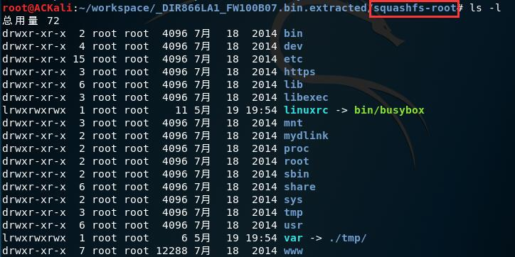

# Fuzzing

## 实验要求

- [x] 搜集市面上主要的路由器厂家、在厂家官网中寻找可下载的固件，在 CVE 漏洞数据中查找主要家用路由器厂家已经公开的漏洞，选择一两个能下载到且有已经公开漏洞的固件
- [ ] 下载对应版本的固件后，在 QEMU 中模拟运行。确定攻击面（对哪个端口哪个协议进行 Fuzzing 测试），尽可能多的抓取攻击面正常的数据包（Wireshark）
- [ ] 查阅 BooFuzz 的文档，编写对这个攻击面，这个协议的脚本，进行 Fuzzing。配置 BooFuzz QEMU 的崩溃异常检测，争取触发一次固件崩溃，获得崩溃相关的输入测试样本和日志
- [ ] 尝试使用调试器和 IDA-pro 监视目标程序的崩溃过程，分析原理

## 实验过程

- 市面上路由器厂家比较多ΦωΦ，华为、D-Link、TP-Link等等，CVE 也能搜到很多已公开的漏洞（有的官网也可以找得到），固件一般可以通过官网「支持（Support）」找到下载页面

### 实验环境

#### 固件

- NETGEAR: R6220 — AC1200 Smart WiFi Router with External Antennas / R6220
- Firmware Version 1.1.0.86
- 漏洞：[Authentication Bypass - CVE-2019-17137](http://cve.mitre.org/cgi-bin/cvename.cgi?name=CVE-2019-17137)

#### ACKali

- Kali Linux

### QEMU 模拟

- 安装：`sudo apt install qemu`
- 解压官网上下载下来的 ZIP 文件，获得一个 IMG 文件，使用`binwalk`递归提取：`binwalk -Me R6220-V1.1.0.86.img`
- 在提取的文件夹下可以看到`squashfs-root`文件夹，其中包含整个文件系统： 

## 参考资料

- [QEMU](https://www.qemu.org/)
- [Emulating Embedded Linux Devices with QEMU](https://www.novetta.com/2018/02/emulating-embedded-linux-devices-with-qemu/)

### 部分厂家固件下载地址

- [华为](https://support.huawei.com/enterprise/zh/software/index.html)
- [TP-Link](https://service.tp-link.com.cn/download?classtip=all&p=1&o=0)
- [D-Link](http://support.dlink.com.cn:9000/AllPro.aspx)
- [NETGEAR](https://www.netgear.com/support/download/)