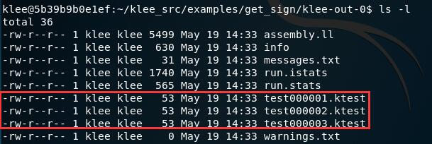

# 符号执行

## 实验要求

- [ ] 安装 KLEE，完成官方 Tutorials

## 实验环境

### ACKali

- Kali Linux

## 安装 KLEE

```bash
# 启动 docker
systemctl start docker

# 安装 KLEE
docker pull klee/klee:2.0

# 启动，在容器中使用 KLEE
# 创建一个临时容器，退出后自动删除
docker run --rm -ti --ulimit='stack=-1:-1' klee/klee:2.0

# 创建一个长期容器并命名
docker run -ti --name=klee_container --ulimit='stack=-1:-1' klee/klee
# 退出后可通过名字再次进入
docker start -ai klee_container
# 删除长期容器
docker rm klee_container
```

## Tutorial 1 - Testing a Small Function

- 需要测试的函数为`get_sign`
    ```c
    int get_sign(int x) {
    if (x == 0) return 0;
    if (x < 0) return -1;
    else return 1;
    }
    ```
- 为了使用 KLEE 来测试`get_sign`函数，需要通过`klee_make_symbolic()`函数将变量标记为符号，主函数如下：
    ```c
    int main() {
    int a;
    // 需要头文件 klee/klee.h
    klee_make_symbolic(&a, sizeof(a), "a");
    return get_sign(a);
    }
    ```
- 启动 KLEE 容器，`get_sign.c`文件位于`/home/klee/klee_src/examples/get_sign`目录下（容器下没有`vim`，需要自己装，~~吃鲸~~）
- KLEE 操作基于 LLVM bitcode，将 C 语言文件编译转化为 LLVM bitcode：`clang -I ../../include -emit-llvm -c -g -O0 -Xclang -disable-O0-optnone get_sign.c`
- 基于 bitcode 文件执行 KLEE：`klee get_sign.bc`
<br>
  - `get_sign`函数有三条完整路径，a 等于 0、a 大于 0 和 a 小于 0
  - KLEE 为每条路径生成了一个测试
  - KLEE 执行后的输出结果在`klee-out-0`文件夹中，包括 KLEE 生成的测试（`klee-last`为指向`klee-out-0`的软链接文件夹）

- 测试文件为二进制文件，可通过`ktest-tool`查看
<br>
- 使用测试用例运行程序，查看输出结果
  ```bash
  # 设置除默认路径外查找动态链接库的路径
  export LD_LIBRARY_PATH=~/klee-build/lib/:$LD_LIBRARY_PATH

  # 将程序与 libkleeRuntest 库链接
  gcc -I ../../include -L /home/klee/klee-build/lib/ get_sign.c -lkleeRuntest

  # 设置 KTEST_FILE 的值指向期望的测试用例的文件名
  KTEST_FILE=klee-last/test000001.ktest ./a.out
  ```

## 参考资料

- [Tutorials · KLEE](https://klee.github.io/tutorials/)