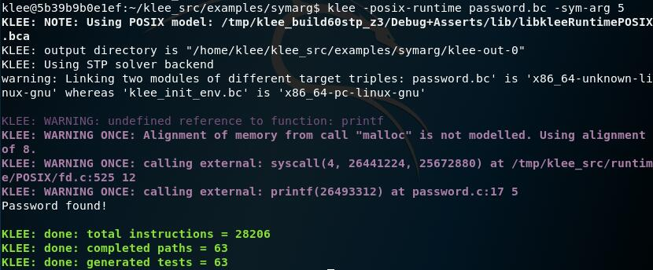

# 符号执行

## 实验要求

- [x] 安装 KLEE，完成官方 Tutorials
  - [Testing a Small Function](#tutorial-1---testing-a-small-function)
  - [Testing a Simple Regular Expression Library](#tutorial-2---testing-a-simple-regular-expression-library)
  - [The Symbolic Maze!](#tutorial-3---the-symbolic-maze)
  - [Using Symbolic Environment](#tutorial-7---using-symbolic-environment)

## 实验环境

### ACKali

- Kali Linux

## 安装 KLEE

```bash
# 启动 docker
systemctl start docker

# 安装 KLEE
docker pull klee/klee:2.0

# 启动，在容器中使用 KLEE
# 创建一个临时容器，退出后自动删除
docker run --rm -ti --ulimit='stack=-1:-1' klee/klee:2.0

# 创建一个长期容器并命名
docker run -ti --name=klee_container --ulimit='stack=-1:-1' klee/klee
# 退出后可通过名字再次进入
docker start -ai klee_container
# 删除长期容器
docker rm klee_container
```

## Tutorial 1 - Testing a Small Function

- 需要测试的函数为`get_sign`
    ```c
    int get_sign(int x) {
    if (x == 0) return 0;
    if (x < 0) return -1;
    else return 1;
    }
    ```
- 为了使用 KLEE 来测试`get_sign`函数，需要通过`klee_make_symbolic()`函数将变量标记为符号，主函数如下：
    ```c
    int main() {
    int a;
    // 需要头文件 klee/klee.h
    klee_make_symbolic(&a, sizeof(a), "a");
    return get_sign(a);
    }
    ```
- 启动 KLEE 容器，`get_sign.c`文件位于`/home/klee/klee_src/examples/get_sign`目录下（容器下没有`vim`，需要自己装，~~吃鲸~~）
- KLEE 操作基于 LLVM bitcode，将 C 语言文件编译转化为 LLVM bitcode：`clang -I ../../include -emit-llvm -c -g -O0 -Xclang -disable-O0-optnone get_sign.c`
  - 使用`-I`参数让编译器能找到头文件`klee/klee.h`
  - 使用`-g`向 bitcode 文件添加调试信息
  - `-O0 -Xclang -disable-O0-optnone`只允许 KLEE 自己的优化
- 基于 bitcode 文件执行 KLEE：`klee get_sign.bc`
<br>
  - `get_sign`函数有三条完整路径，a 等于 0、a 大于 0 和 a 小于 0
  - KLEE 为每条路径生成了一个测试
  - KLEE 执行后的输出结果在`klee-out-0`文件夹中，包括 KLEE 生成的测试（`klee-last`为指向`klee-out-0`的软链接文件夹，一般创建时指向最近创建的文件）

- 测试文件为二进制文件，可通过`ktest-tool`查看
<br>
- 使用测试用例运行程序，查看输出结果
  ```bash
  # 设置除默认路径外查找动态链接库的路径
  export LD_LIBRARY_PATH=~/klee_build/lib/:$LD_LIBRARY_PATH

  # 将程序与 libkleeRuntest 库链接
  gcc -I ../../include -L /home/klee/klee_build/lib/ get_sign.c -lkleeRuntest

  # 设置 KTEST_FILE 的值指向期望的测试用例的文件名
  KTEST_FILE=klee-last/test000001.ktest ./a.out

  KTEST_FILE=klee-last/test000002.ktest ./a.out

  KTEST_FILE=klee-last/test000003.ktest ./a.out

  # 每次执行后查看返回值
  echo $?
  ```
  
  - `-1`已转换为 0-255 范围内有效的退出状态码

## Tutorial 2 - Testing a Simple Regular Expression Library

- 示例代码`Regexp.c`位于`/home/klee/klee_src/examples/regexp`目录下
- 将 C 语言文件编译转化为 LLVM bitcode：`clang -I ../../include -emit-llvm -c -g -O0 -Xclang -disable-O0-optnone Regexp.c`
  - `-c`：将代码编译为对象文件，而非原生可执行程序
- 使用 KLEE 运行代码：`klee --only-output-states-covering-new Regexp.bc`

- 如果 KLEE 在程序执行时发现了错误，就会生成能触发错误的测试用例，并将关于错误的附加信息写入文件`testN.TYPE.err`（`N`是测试样例编号，`TYPE`指明错误类型）

  Type | Descriptiond
  -|-
  ptr|Stores or loads of invalid memory locations
  free|Double or invalid free()
  abort|The program called abort()
  assert|An assertion failed
  div|A division or modulus by zero was detected
  user|There is a problem with the input (invalid klee intrinsic calls) or the way KLEE is being used
  exec|There was a problem which prevented KLEE from executing the program; for example an unknown instruction, a call to an invalid function pointer, or inline assembly
  model|KLEE was unable to keep full precision and is only exploring parts of the program state. For example, symbolic sizes to malloc are not currently supported, in such cases KLEE will concretize the argument
- 从上面的结果可以看到，KLEE 检测出了两个内存错误，用`cat`查看其中一个的内容：<br>

- KLEE 发现这个错误并不是因为正则表达式的函数有 BUG，而是指出测试驱动程序存在问题。我们使输入正则表达式缓冲区完全符号化，而匹配函数期望它是以`\0`结尾的字符串
- 使缓冲区符号化只是将内容初始化为引用符号变量，我们仍可以修改内存，最简单的解决方法是在符号化后在缓冲区末尾添加`\0`，修改后：
  ```c
  int main() {
    // The input regular expression.
    char re[SIZE];

    // Make the input symbolic.
    klee_make_symbolic(re, sizeof re, "re");
    re[SIZE - 1] = '\0';

    // Try to match against a constant string "hello".
    match(re, "hello");

    return 0;
  }
  ```
  
- 使用`klee_assume`内置函数可以达到同样的效果（但更灵活），`klee_assume`接受一个无符号整数的参数，通常是某种条件表达式，并且假设该表达式在当前路径上为真（如果这种情况永远不会发生，KLEE 将报错）。使用`klee_assume`使 KLEE 只探索以`\0`结尾的字符串：
  ```c
  int main() {
    // The input regular expression.
    char re[SIZE];

    // Make the input symbolic.
    klee_make_symbolic(re, sizeof re, "re");
    klee_assume(re[SIZE - 1] == '\0');

    // Try to match against a constant string "hello".
    match(re, "hello");

    return 0;
  }
  ```
- 注意：在对多个条件语句使用`klee_assume`时，类似`&&`和`||`布尔条件句可能会被编译成计算表达式结果之前的分支代码，这种情况下 KLEE 可能将在调用`klee_assume`之前岔开进程，探索不必要的状态。尽可能使用简单的表达式，并使用`&`和`|`运算符

## Tutorial 3 - The Symbolic Maze!

- 退出 KLEE 的容器，直接使用`klee-maze`的 Docker 镜像
  ```bash
  docker pull grese/klee-maze
  docker run -it grese/klee-maze
  ```
- 迷宫文件在`~/maze`文件夹下
- 迷宫 C 代码分析
  ```c
  #include<string.h>
  #include<stdio.h>
  #include<stdlib.h>

  // Maze hardcoded dimensions
  #define H 7
  #define W 11
  #define ITERS 28

  // The maze map
  char maze[H][W] = {
      "+-+---+---+",
      "| |     |#|",
      "| | --+ | |",
      "| |   | | |",
      "| +-- | | |",
      "|     |   |",
      "+-----+---+"
  };


  // Draw the maze state in the screen!
  void draw ()
  {
    int i, j;
    for (i = 0; i < H; i++)
      {
        for (j = 0; j < W; j++)
            printf ("%c", maze[i][j]);
        printf ("\n");
      }
    printf ("\n");
  }

  // The main function
  int main (int argc, char *argv[])
  {
    int x, y;     // Player position
    int ox, oy;   // Old player position
    int i = 0;    // Iteration number
    char program[ITERS];

  // Initial position
    x = 1;
    y = 1;
    maze[y][x]='X';

  // Read the directions 'program' to execute...
      read(0,program,ITERS);

  // Iterate and run 'program'
    while(i < ITERS)
      {
        // Save old player position
        ox = x;
        oy = y;
        // Move polayer position depending on the actual command
        switch (program[i])
        {
        case 'w':
          y--;
          break;
        case 's':
          y++;
          break;
        case 'a':
          x--;
          break;
        case 'd':
          x++;
          break;
        default:
            printf("Wrong command!(only w,s,a,d accepted!)\n");
            printf("You loose!\n");
            exit(-1);
        }

        // If hit the price, You Win!!
        if (maze[y][x] == '#')
          {
            printf ("You win!\n");
            printf ("Your solution <%42s>\n",program);
            exit (1);
          }
        // If something is wrong do not advance
        if (maze[y][x] != ' ' && !((y == 2 && maze[y][x] == '|' && x > 0 && x < W)))
            // 当 y 值为 2 且 x 值在迷宫范围内，当前位置为墙时，可以穿墙！
          {
            x = ox;
            y = oy;
          }

        // If crashed to a wall! Exit, you loose
        if (ox==x && oy==y){
              printf("You loose\n");
              exit(-2);
        }

        maze[y][x]='X'; // put the player on the maze
        draw (); //draw it

        i++;  //increment iteration
        sleep(1); //wait to human
      }
  // You couldn't make it! You loose!
  printf("You loose\n");
  }
  ```
- 先看看程序运行的效果
  ```bash
  # 编译
  gcc maze.c -o maze

  # solution.txt 中存储的是人肉眼可见的「唯一」解决方案
  cat solution.txt | ./maze
  ```
- 手动寻路（`a`左，`d`右，`w`上，`s`下）<br>

- 修改`maze.c`以便使用 KLEE 测试，修改后的文件为`maze_klee.c`
  ```c
  // 添加头文件
  #include<klee/klee.h>

  // 将
  read(0,program,ITERS);
  // 替换为
  klee_make_symbolic(program,ITERS,"program");

  if (maze[y][x] == '#')
  {
      printf("You win!\n");
      printf("Your solution %s\n", program);
      // 添加 klee_assert(0) 来标志成功的情况
      // KLEE 将会在成功的情况报错，以区别一般的情况
      klee_assert(0);
      exit(1);
  }
  ```
- 将 C 语言文件编译转化为 LLVM bitcode 并使用 KLEE 运行，最终求解出四种解法
  ```bash
  cd ~/maze

  cat ./scripts/build_bc.sh
  # #!/bin/bash

  # # Builds the llvm bytecode from maze_klee.c source
  # clang -c -I../klee_src/include -emit-llvm ./maze_klee.c -o ./maze_klee.bc
  ./scripts/build_bc.sh

  cat ./scripts/run_klee.sh
  # #!/bin/bash

  # # Runs klee on maze bytecode file
  # klee --emit-all-errors ./maze_klee.bc
  # -emit-all-errors: Generate tests cases for all errors (default=false, i.e. one per (error,instruction) pair)
  ./scripts/run_klee.sh

  cat ./scripts/show_solutions.sh
  # #!/bin/bash
  # # Get testIDs from tests where klee threw an assertion.
  # TEST_IDS=`find ./klee-last/*.assert.err -printf "%f\n" | sed -r 's/(.*).assert.err/\1/'`;
  # # Bail out if no klee assertions found. Otherwise, print header.
  # if [ -z "$TEST_IDS" ];
  # then
  #     echo "No solutions found";
  #     exit -1;
  # else
  #     echo "";
  #     echo "TESTID       SOLUTION";
  # fi
  # # Get result for each test, and print solution.
  # for test_id in $TEST_IDS;
  # do
  #     # Get klee results for testID
  #     RESULT=`ktest-tool "./klee-last/$test_id.ktest"`;
  #     # Extract the solution from test results
  #     SOLUTION=`echo $RESULT | sed -r 's/(.*)\stext:\s//'`;
  #     echo "$test_id:  $SOLUTION";
  # done
  # echo "";
  ./scripts/show_solutions.sh
  ```
  
- emm？有一个很短诶？手动跑一下看看，穿墙而过！恭喜 KLEE 成功发现了后门ヽ(°◇° )ノ<br>


## Tutorial 7 - Using Symbolic Environment

### `-sym-arg` Usage

- `klee_make_symbolic()`面向程序内定义的变量，`-sym-arg`面向命令行参数
- `-sym-arg <N>`向程序提供一个长度为 N 的符号参数，它的变种`-sym-args <MIN> <MAX> <N>`提供最少 MIN 个、最多 MAX 个符号参数，每一个参数最大长度为 N
- `password.c`：根据一个硬编码的密码，查找是否有匹配的命令行参数
  ```c
  #include <stdio.h>

  int check_password(char *buf) {
    if (buf[0] == 'h' && buf[1] == 'e' &&
        buf[2] == 'l' && buf[3] == 'l' &&
        buf[4] == 'o')  // hello
      return 1;
    return 0;
  }

  int main(int argc, char **argv) {
    if (argc < 2)
      return 1;

    if (check_password(argv[1])) {
      printf("Password found!\n");
      return 0;
    }

    return 1;
  }
  ```
- KLEE 使用选项`-posix-runtime`来启用符号环境
  ```bash
  clang -c -g -emit-llvm password.c
  klee -posix-runtime password.bc -sym-arg 5
  ```
  结果一下跑出 63 条路径(°◇° )<br>
  
- 写一个脚本看一下，生成的各种字符串有空格和不可打印字符，最后一个是结束符，所幸结果还是找到了
  ```bash
  #!/usr/bin/env bash

  num=($(seq -w 1 63))
  for i in "${num[@]}"; do
    echo -n "$i: "
    ktest-tool "klee-last/test0000$i.ktest" | grep "object 0: text: "
  done
  ```
  ```bash
  $ bash show-result.sh
  01: object 0: text: .  ...
  02: object 0: text: . .. .
  03: object 0: text: . ....
  04: object 0: text:    ...
  05: object 0: text: . . ..
  06: object 0: text: . .  .
  07: object 0: text: h  ...
  08: object 0: text:  . . .
  09: object 0: text:      .
  10: object 0: text:    . .
  11: object 0: text: he ...
  12: object 0: text: .    .
  13: object 0: text: hel...
  14: object 0: text: ..  ..
  15: object 0: text: h. . .
  16: object 0: text: h    .
  17: object 0: text:  . ...
  18: object 0: text:  .....
  19: object 0: text:  ..  .
  20: object 0: text: .. ...
  21: object 0: text: .. . .
  22: object 0: text: h ....
  23: object 0: text:   ....
  24: object 0: text:   .. .
  25: object 0: text: .  . .
  26: object 0: text: .   ..
  27: object 0: text:  ... .
  28: object 0: text: h.   .
  29: object 0: text: ......
  30: object 0: text: h  . .
  31: object 0: text:  .   .
  32: object 0: text: h. ...
  33: object 0: text: .... .
  34: object 0: text: he.. .
  35: object 0: text: h .. .
  36: object 0: text: he   .
  37: object 0: text:   .  .
  38: object 0: text: ..   .
  39: object 0: text: hel  .
  40: object 0: text: h .  .
  41: object 0: text: h... .
  42: object 0: text: h.....
  43: object 0: text: he....
  44: object 0: text: h..  .
  45: object 0: text: he . .
  46: object 0: text:  .  ..
  47: object 0: text: ... ..
  48: object 0: text: h . ..
  49: object 0: text: hel. .
  50: object 0: text: he.  .
  51: object 0: text: h.  ..
  52: object 0: text: ...  .
  53: object 0: text: hell .
  54: object 0: text:   . ..
  55: object 0: text: hello.  # Password Find！
  56: object 0: text:  .. ..
  57: object 0: text: he. ..
  58: object 0: text: h.. ..
  59: object 0: text:     ..
  60: object 0: text: h   ..
  61: object 0: text: he  ..
  62: object 0: text: hell..
  63: object 0: text: hel ..
  ```

### `-sym-files` Usage

- 选项`-sym-files <NUM> <N>`创建 NUM 个 符号文件，第一个文件名为 A，第二个文件名为 B，以此类推，大小都为 N
- 类似的选项`-sym-stdin`和`-sym-stdout`将标准输入/输出符号化
- `password.c`：从指定的文件中读取字符串，判断是否匹配硬编码的密码；如果未指定文件，或者在打开文件失败，将从标准输入中读取
  ```c
  #include <sys/types.h>
  #include <sys/stat.h>
  #include <fcntl.h>
  #include <stdio.h>
  #include <unistd.h>

  int check_password(int fd) {
    char buf[5];
    if (read(fd, buf, 5) != -1) {
      if (buf[0] == 'h' && buf[1] == 'e' &&
    buf[2] == 'l' && buf[3] == 'l' &&
    buf[4] == 'o')
        return 1;
    }
    return 0;
  }

  int main(int argc, char **argv) {
    int fd;

    if (argc >= 2) {
      if ((fd = open(argv[1], O_RDONLY)) != -1) {
        if (check_password(fd)) {
          printf("Password found in %s\n", argv[1]);
          close(fd);
          return 0;
        }
        close(fd);
        return 1;
      }
    }

    if (check_password(0)) {
      printf("Password found in standard input\n");
      return 0;
    }

    return 1;
  }
  ```
- 将 C 语言文件编译转化为 LLVM bitcode：`clang -c -g -emit-llvm password.c`
- 使用`-sym-stdin`提供一个长度为 10 标准符号输入：`klee -posix-runtime password.bc -sym-stdin 10`，KLEE 成功找到密码<br>

- 通过指定选项`-sym-files 1 10`，KLEE 将提供一个大小为 10 字节的符号文件，该文件被 KLEE 命名为 A，因此可以将该文件的文件名作为参数提供给我们编写的程序，KLEE 也能成功找到密码：`klee -posix-runtime password.bc A -sym-files 1 10`<br>


## 参考资料

- [Tutorials · KLEE](https://klee.github.io/tutorials/)
- [klee-maze](https://github.com/grese/klee-maze)