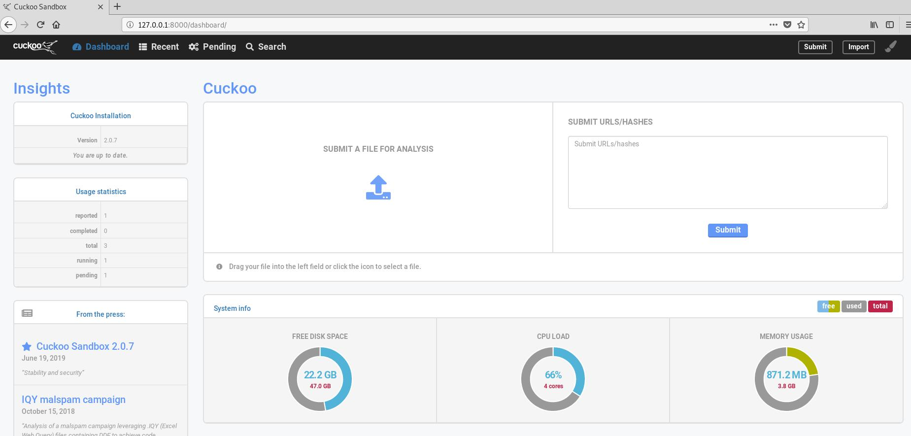

# Sandbox

## 实验要求

- [x] 安装并使用 cuckoo
- [x] 在 cuckoo 中 trace 获取软件行为的基本数据

## 实验环境

### Host - ACKali

- 系统：Kali Linux
- 网络配置
  - eth0 - NAT 网络
  - vboxnet0 - 内嵌虚拟机 Host-Only IP 地址：192.168.56.1

### Guest - HappyWin

- 系统：Windows 7 - 64-bit
- 网络配置
  - Host-Only IP 地址：192.168.56.101

## 实验过程

### Host 端 - 安装 cuckoo

令人吃鲸的是：`Cuckoo is Python2-only at the moment!`(o_ _)ﾉ
```bash
sudo apt update
sudo apt install python python-pip python-dev libffi-dev libssl-dev virtualenv python-setuptools libjpeg-dev zlib1g-dev swig

# 为了使用基于 Django 的 Web 接口，安装 mongodb
# Install MongoDB Community Edition on Debian: https://docs.mongodb.com/manual/tutorial/install-mongodb-on-debian/#install-mongodb-community-edition-on-debian
wget -qO - https://www.mongodb.org/static/pgp/server-4.2.asc | sudo apt-key add -
echo "deb http://repo.mongodb.org/apt/debian buster/mongodb-org/4.2 main" | sudo tee /etc/apt/sources.list.d/mongodb-org-4.2.list
sudo apt update
sudo apt install mongodb-org
# Mongo cant start service: https://www.digitalocean.com/community/questions/mongo-cant-start-service
chown mongodb:mongodb /tmp/mongodb-27017.sock
sudo systemctl enable mongod
# 启动
sudo systemctl daemon-reload
sudo systemctl start mongod

# 安装 cuckoo
pip install -U pip setuptools
pip install -U cuckoo

# 为了分析时远程操控，安装 guacd
git clone https://github.com/MysticRyuujin/guac-install.git /tmp/guac-install
cd /tmp/guac-install/
sudo ./guac-install.sh --nomfa --installmysql --mysqlpwd pass --guacpwd pass
# 软件包依赖问题可通过 aptitude 解决

# 安装 Volatility
# distorm3 v3.5.0 breaks volatility: https://github.com/volatilityfoundation/volatility/issues/719
pip install distorm3==3.4.4 openpyxl ujson pycrypto pytz
git clone https://github.com/volatilityfoundation/volatility.git
cd volatility/
python setup.py build
python setup.py install
```
`cuckoo -d`自动创建工作目录位于`~/.cuckoo`

直接输入`cuckoo`看到类似以下的输出就是安装成功了：<br>


### 宿主机 - 启用嵌套

宿主机的 VirtualBox 设置需要`启用嵌套 VT-x/AMD-V`，否则没办法在虚拟机里建立虚拟机（cuckoo 不支持 Host 端和 Guest 端在互相分离的虚拟机上，参见 [Install the host and guess machine in separate virtual machine.](https://github.com/cuckoosandbox/cuckoo/issues/1683)）

最初的选项呈灰色，无法勾选<br>


在 cmd 中执行以下命令
```bash
vboxmanage modifyvm "Kali Wireless" --nested-hw-virt on
```

就可以勾选`启用嵌套 VT-x/AMD-V`选项了<br>


#### 参考教程

- [在 VirtualBox 6.1 里面打开嵌套 VT-x/AMD-V 功能](https://www.jianshu.com/p/8031924995a4)

### Host 端 - 创建客户机

```bash
# 解决 gsettings-desktop-schemas：Breaks：mutter（<3.19.92） but 3.18.2-1 is to be installed
sudo apt install gsettings-desktop-schemas
sudo apt update

sudo apt install virtualbox

vboxmanage createvm --name "happywin" --ostype Windows7_64 --register
vboxmanage modifyvm "happywin" --memory 1024 --acpi on --boot1 dvd --nic1 nat
vboxmanage createhd --filename "happywin.vdi" --size 24000
vboxmanage storagectl "happywin" --name "IDE Controller" --add ide --controller PIIX4
vboxmanage storageattach "happywin" --storagectl "IDE Controller" --port 0 --device 0 --type hdd --medium "happywin.vdi"
vboxmanage storageattach "happywin" --storagectl "IDE Controller" --port 0 --device 1 --type dvddrive --medium ~/cn_windows_7_enterprise_x64_dvd_x15-70741.iso
vboxmanage hostonlyif create
vboxmanage modifyvm "happywin" --nic1 hostonly
vboxmanage modifyvm "happywin" --hostonlyadapter1 vboxnet0
```

#### Trouble-Shooting

- [unmet dependancies on kali](https://github.com/infobyte/faraday/issues/87#issuecomment-246101450)

### Host 端配置

为了使 Guest 端能够上网，Host 端需要配置端口转发
```bash
iptables -t nat -A POSTROUTING -o eth0 -s 192.168.56.0/24 -j MASQUERADE

# Default drop.
iptables -P FORWARD DROP

# Existing connections.
iptables -A FORWARD -m state --state RELATED,ESTABLISHED -j ACCEPT

# Accept connections from vboxnet to the whole internet.
iptables -A FORWARD -s 192.168.56.0/24 -j ACCEPT

# Internal traffic.
iptables -A FORWARD -s 192.168.56.0/24 -d 192.168.56.0/24 -j ACCEPT

# Log stuff that reaches this point (could be noisy).
iptables -A FORWARD -j LOG

# 使以上规则永久生效
vi /etc/network/interfaces
# 添加
pre-up iptables-restore < /etc/iptables.rules
post-down iptables-save > /etc/iptables.rules

# 开启 IP 转发
echo 1 | sudo tee -a /proc/sys/net/ipv4/ip_forward
sudo sysctl -w net.ipv4.ip_forward=1
# 永久开启
vi /etc/sysctl.conf
# 取消 net.ipv4.ip_forward=1 的注释
sysctl -p /etc/sysctl.conf
```

为了使 cuckoo 能够运行，需要做一些必要的修改，配置文件位于`$CWD/conf`目录下

#### cuckoo.conf

```bash
# 仅列出需要修改的内容

[resultserver]
ip = 192.168.56.1

[remotecontrol]
enabled = yes
```

#### virtualbox.conf

```bash
# 仅列出需要修改的内容

machines = happywin

[happywin]
label = happywin
platform = windows
ip = 192.168.56.101
snapshot = finish-configuration
interface = vboxnet0
```

#### reporting.conf

```bash
# 仅列出需要修改的内容

[mongodb]
enabled = yes
```

### Guest 端配置

- 启动虚拟机：`vboxmanage startvm "happywin"`
- 网络配置（可能仍然会显示`无 Internet 访问`，但实际上已经可以访问网络了）<br>

- 需要安装 Python 2.7（根据官方教程操作，不过多赘述）
  - 安装依赖包：`pip install pillow`
- 关闭防火墙<br>

- 关闭自动更新（或者选择从不检查更新）<br>

- 关闭用户访问控制<br>

- 安装 Agent
  - 通过共享文件夹分享 Host 端的`~/.cuckoo/agent/agent.py`文件（需安装增强功能），将其移动到 Guest 端系统开机启动目录中，Win 7 默认的路径是`C:\Users\[USER]\AppData\Roaming\MicroSoft\Windows\Start Menu\Programs\Startup\`（`AppData`是隐藏文件夹）
  - 将`agent.py`改为`agent.pyw`，程序启动时就没有 GUI 窗口
- 配置完成，启动`agent.pyw`，为客户机建立一个快照（快照名为`finish-configuration`），方便每次分析完恶意样本之后的恢复

### 使用 cuckoo

- 启动 cuckoo：`cuckoo`
- 在另一个标签页，开启 web 服务：`cuckoo web runserver`
- 打开浏览器，通过 http://127.0.0.1:8000 即可进入 web 操作界面<br>

  

### 软件分析 - 熊猫烧香

- 上传文件`GameSetup.exe`，并进行分析前的配置，配置完成后点击`Analyze`，之后 cuckoo 会自动分析，需要一段时间<br>

- 分析完成后，点击`reported`前往查看分析报告<br>

- cuckoo 的分析报告还是比较详细的，在侧边栏的选项有数字的说明有分析报告的，没有的是空白<br>

- 在总结页面，会给出上传文件的一些基本信息，运行时的日志和截图（不知道为啥放在桌面的 EXE 图标没有变化，可能还需要进行手工分析），由 Analyzer Log 可以看到，由`GameSetup.exe`产生了另一个可执行程序并启动<br>

- 由 Behavioral Analysis 可知，产生的可执行程序为`spo0lsv.exe`，由文件名可知该样本是熊猫烧香的变种，下方是关于所选可执行程序的行为跟踪，包括调用的函数、操作的文件等<br>


#### Trouble-Shooting

- [Cuckoo not able to analyze (Read timed out)](https://github.com/cuckoosandbox/cuckoo/issues/2308#issuecomment-498938345)

## 参考资料

- [Cuckoo Sandbox](https://cuckoosandbox.org/)
- [Cuckoo Sandbox Installation Guide](https://medium.com/@warunikaamali/cuckoo-sandbox-installation-guide-d7a09bd4ee1f)
- [Chapter 8. VBoxManage](https://www.virtualbox.org/manual/ch08.html)
- [十分钟学会恶意样本分析，一眼看透无所遁形 - 知乎](https://zhuanlan.zhihu.com/p/43410960)